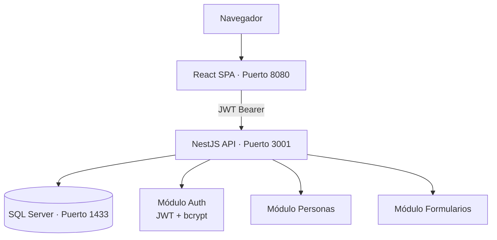

# HumanMobility — Backend

API REST construida con **NestJS 11 + TypeORM + Microsoft SQL Server** para la gestión de personas en situación de movilidad humana (MDMQ).

## Arquitectura



| Capa | Tecnología |
|------|-----------|
| Framework | NestJS 11 |
| ORM | TypeORM |
| Base de datos | Microsoft SQL Server 2022 |
| Autenticación | JWT + Passport + bcrypt |
| Validación | class-validator + ValidationPipe |
| Documentación API | Swagger / OpenAPI |
| Seguridad HTTP | Helmet + CORS + Throttler |

## Requisitos previos

- Node.js 20+
- Microsoft SQL Server 2022 (o usar Docker, ver abajo)

## Instalación

```bash
npm install
cp .env.example .env
# Editar .env con los datos de conexión
```

## Variables de entorno

| Variable | Descripción | Ejemplo |
|----------|-------------|---------|
| `PORT` | Puerto del servidor | `3001` |
| `MSSQL_HOST` | Host del SQL Server | `localhost` |
| `MSSQL_PORT` | Puerto | `1433` |
| `MSSQL_USER` | Usuario | `sa` |
| `MSSQL_PASSWORD` | Contraseña | `Movilidad_2026!` |
| `MSSQL_DATABASE` | Nombre de la BD | `HumanMobility` |
| `MSSQL_OPTIONS_ENCRYPT` | Cifrado TLS | `false` (local) |
| `MSSQL_OPTIONS_TRUST_SERVER_CERTIFICATE` | Certificado auto-firmado | `true` (local) |
| `JWT_SECRET` | Clave secreta JWT | `cambiar-en-produccion` |
| `CORS_ORIGINS` | Origins permitidos (separados por coma) | `http://localhost:5173` |

## Levantar SQL Server con Docker

```bash
# Solo la base de datos
docker run -e ACCEPT_EULA=Y -e MSSQL_SA_PASSWORD=Movilidad_2026! \
  -p 1433:1433 --name mssql \
  mcr.microsoft.com/mssql/server:2022-latest

# O usar el docker-compose.yml de la raíz del proyecto (BD + backend + frontend)
docker-compose up --build
```

Al iniciar, TypeORM crea las tablas automáticamente (`synchronize: true`). El seed crea el primer profesional admin: `admin@mdmq.gob.ec` / `admin123`.

## Comandos

```bash
npm run start:dev   # Servidor en modo desarrollo (hot-reload)
npm run build       # Compilar a dist/
npm run start:prod  # Ejecutar el build de producción
npm run test        # Tests unitarios
npm run test:cov    # Tests con cobertura
npm run lint        # ESLint
```

## Endpoints principales

| Método | Ruta | Auth | Descripción |
|--------|------|------|-------------|
| `POST` | `/api/auth/login` | Público | Obtener JWT |
| `POST` | `/api/auth/register` | ADMIN | Registrar profesional |
| `GET` | `/api/auth/profile` | JWT | Datos del profesional activo |
| `GET` | `/api/personas` | JWT | Listar personas |
| `POST` | `/api/personas` | JWT | Crear persona |
| `GET` | `/api/personas/:id` | JWT | Detalle de persona |
| `PATCH` | `/api/personas/:id` | JWT | Actualizar persona |
| `GET` | `/api/forms/definitions` | JWT | Listar formularios disponibles |
| `GET` | `/api/forms/definition/:slug` | JWT | Schema del formulario |
| `PUT` | `/api/forms/definition/:slug` | JWT | Actualizar schema (crea nueva versión) |
| `GET` | `/api/forms/submissions/:personaId/:slug` | JWT | Última respuesta guardada |
| `PUT` | `/api/forms/submissions/:personaId/:slug` | JWT | Guardar respuesta |
| `GET` | `/api/forms/submissions/:personaId/:slug/history` | JWT | Historial de respuestas |

Documentación interactiva: `http://localhost:3001/api/docs`

## Roles de profesionales

| Rol | Descripción |
|-----|-------------|
| `admin` | Acceso total, puede registrar profesionales |
| `trabajador_social` | Gestión de personas y formularios sociales |
| `psicologo` | Formularios psicológicos |
| `abogado` | Formularios legales |
| `consulta` | Solo lectura |
